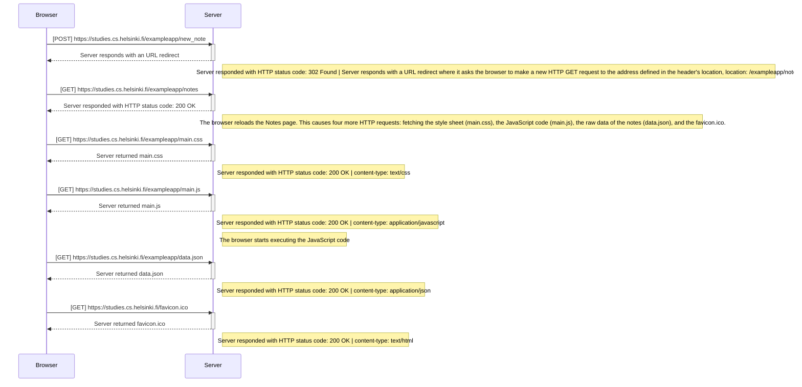

```mermaid
sequenceDiagram
    
    participant Browser
    participant Server

    %% [Request/Response NR: 1] ************************************************
    
    Browser->>Server: [POST] https://studies.cs.helsinki.fi/exampleapp/new_note 
    activate Server

    Server-->>Browser: Server responds with an URL redirect
    deactivate Server

    Note right of Server: Server responded with HTTP status code: 302 Found | Server responds with a URL redirect where it asks the browser to make a new HTTP GET request to the address defined in the header's location, location: /exampleapp/notes.

    %% [Request/Response NR: 2] ************************************************

    Browser->>Server: [GET] https://studies.cs.helsinki.fi/exampleapp/notes
    activate Server
    
    Server-->>Browser: Server responded with HTTP status code: 200 OK
    deactivate Server

    Note right of Server: The browser reloads the Notes page. This causes four more HTTP requests: fetching the style sheet (main.css), the JavaScript code (main.js), the raw data of the notes (data.json), and the favicon.ico. 

    %% [Request/Response NR: 3] ************************************************

    Browser->>Server: [GET] https://studies.cs.helsinki.fi/exampleapp/main.css
    activate Server

    Server-->>Browser: Server returned main.css
    deactivate Server

    Note right of Server: Server responded with HTTP status code: 200 OK | content-type: text/css;

    %% [Request/Response NR: 4] ************************************************

    Browser->>Server: [GET] https://studies.cs.helsinki.fi/exampleapp/main.js
    activate Server

    Server-->>Browser: Server returned main.js
    deactivate Server

    Note right of Server: Server responded with HTTP status code: 200 OK | content-type: application/javascript;
    Note right of Server: The browser starts executing the JavaScript code

    %% [Request/Response NR: 5] ************************************************

    Browser->>Server: [GET] https://studies.cs.helsinki.fi/exampleapp/data.json
    activate Server

    Server-->>Browser: Server returned data.json
    deactivate Server

    Note right of Server: Server responded with HTTP status code: 200 OK | content-type: application/json;

    %% [Request/Response NR: 6] ************************************************

    Browser->>Server: [GET] https://studies.cs.helsinki.fi/favicon.ico
    activate Server

    Server-->>Browser: Server returned favicon.ico
    deactivate Server

    Note right of Server: Server responded with HTTP status code: 200 OK | content-type: text/html


```