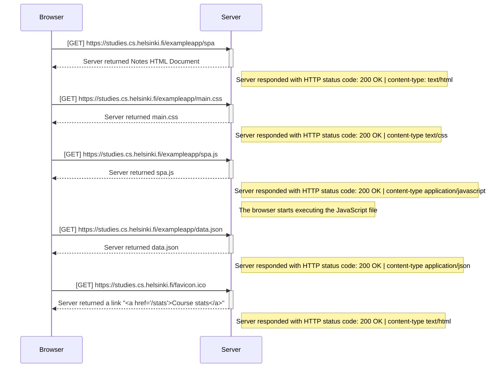

```mermaid
sequenceDiagram

    participant browser as Browser
    participant server as Server

    %% ************************************************************************
    %% [Request/Response NR: 1 ************************************************
    %% ************************************************************************

    browser->>server: [GET] https://studies.cs.helsinki.fi/exampleapp/spa
    activate server

    server-->>browser: Server returned Notes HTML Document
    deactivate server

    Note right of server: Server responded with HTTP status code: 200 OK | content-type: text/html;

    %% ************************************************************************
    %% [Request/Response NR: 2 ************************************************
    %% ************************************************************************

    browser->>server: [GET] https://studies.cs.helsinki.fi/exampleapp/main.css
    activate server

    server-->>browser: Server returned main.css
    deactivate server

    Note right of server: Server responded with HTTP status code: 200 OK | content-type text/css;

    %% ************************************************************************
    %% [Request/Response NR: 3 ************************************************
    %% ************************************************************************

    browser->>server: [GET] https://studies.cs.helsinki.fi/exampleapp/spa.js
    activate server

    server-->>browser: Server returned spa.js 
    deactivate server

    Note right of server: Server responded with HTTP status code: 200 OK | content-type application/javascript; 

    Note right of server: The browser starts executing the JavaScript file

    %% ************************************************************************
    %% [Request/Response NR: 4 ************************************************
    %% ************************************************************************

    browser->>server: [GET] https://studies.cs.helsinki.fi/exampleapp/data.json
    activate server

    server-->>browser: Server returned data.json
    deactivate server

    Note right of server: Server responded with HTTP status code: 200 OK | content-type application/json; 

    %% ************************************************************************
    %% [Request/Response NR: 5 ************************************************
    %% ************************************************************************

    browser->>server: [GET] https://studies.cs.helsinki.fi/favicon.ico
    activate server

    server-->>browser: Server returned a link "<a href="/stats">Course stats</a>"
    deactivate server

    Note right of server: Server responded with HTTP status code: 200 OK | content-type text/html

```