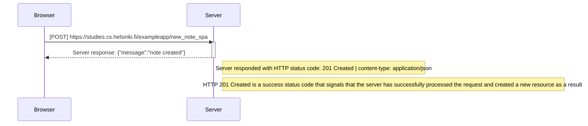

```mermaid
sequenceDiagram

    participant browser as Browser
    participant server as Server

    %% ************************************************************************
    %% [Request/Response NR: 1 ************************************************
    %% ************************************************************************

    browser->>server: [POST] https://studies.cs.helsinki.fi/exampleapp/new_note_spa
    activate server

    server-->>browser: Server response: {"message":"note created"}
    deactivate server

    Note right of server: Server responded with HTTP status code: 201 Created | content-type: application/json;

    Note right of server: HTTP 201 Created is a success status code that signals that the server has successfully processed the request and created a new resource as a result.

```